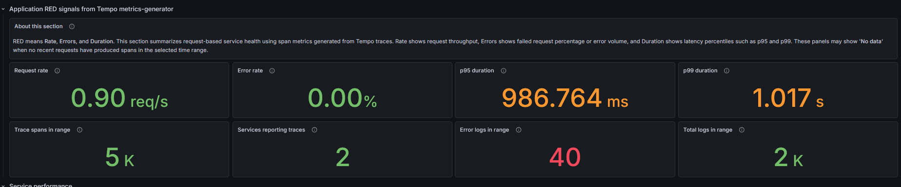
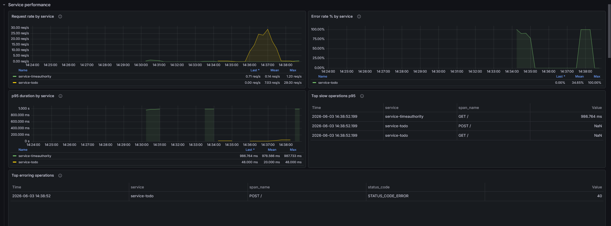
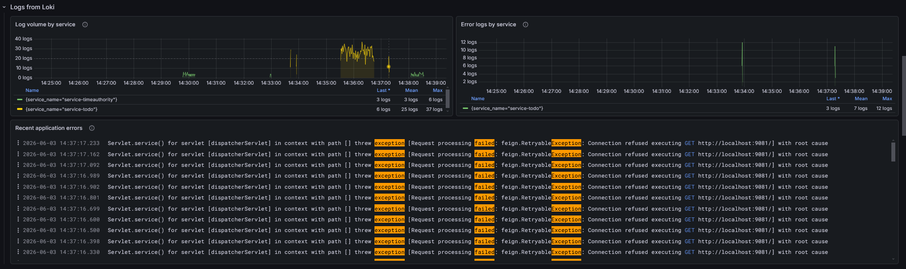
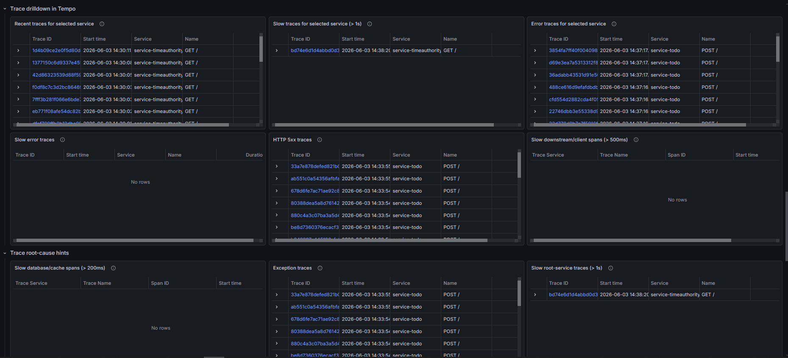

# QLACK-lgtm Helm Chart

This repository contains the `qlack-lgtm` Helm chart, which deploys a complete observability stack built around Grafana **Loki**, **Mimir**, **Tempo**, **Grafana**, and the **OpenTelemetry Collector**.

The chart itself lives in [`helm/`](./helm), and the chart name in [`helm/Chart.yaml`](./helm/Chart.yaml) is **`qlack-lgtm`**.

## What this chart deploys

The chart installs and wires together the following components:

- **OpenTelemetry Collector** (`otelCollector`) for ingesting OTLP telemetry from applications, with optional Kubernetes and node metrics collection
- **Grafana Loki** for log storage and querying
- **Grafana Mimir** for Prometheus-compatible metrics storage
- **Grafana Tempo** for distributed tracing
- **Grafana** with pre-provisioned datasources and a built-in QLACK dashboard

## Architecture summary

By default, the deployment works like this:

1. **Collection**
   - The OpenTelemetry Collector runs as a **DaemonSet**.
   - It accepts **OTLP traces, metrics, and logs** from applications on ports `4317` and `4318`.
   - Host, kubelet, and cluster metrics collection is supported, but disabled by default.
2. **Processing**
   - The collector applies batching and memory limiting.
3. **Export**
   - Logs are exported to **Loki**
   - Metrics are exported to **Mimir**
   - Traces are exported to **Tempo**
4. **Visualization**
   - Grafana is pre-configured with **Loki**, **Prometheus/Mimir**, and **Tempo** datasources.
   - A built-in dashboard is provisioned from [`helm/files/dashboards/qlack-overview.json`](./helm/files/dashboards/qlack-overview.json).

## Dashboard overview

Grafana ships with a pre-provisioned **QLACK OTEL-LGTM Observability Overview** dashboard (set as the Grafana home page). It correlates metrics, logs, and traces from the LGTM stack in a single view. The screenshots below highlight its main sections.

> Panels may show **No data** until applications start sending OTLP telemetry to the collector.

### Application RED signals

Rate, Errors, and Duration summary derived from Tempo metrics-generator span metrics, including request rate, error rate, p95/p99 latency, and trace/log counts for the selected range.



### Service performance

Per-service request rate, error rate, and p95 duration over time, plus tables of the slowest and most error-prone operations.



### Logs from Loki

Log volume and error logs broken down by service, alongside a live view of recent application errors.



### Trace drilldown in Tempo

Tempo-backed trace tables for exploring recent, slow, error, and HTTP 5xx traces, with root-cause hint panels for deeper investigation.



## Important default behavior

Before deploying, note these defaults from [`helm/values.yaml`](./helm/values.yaml):

- **Container log scraping is disabled by default**:
  - `otelCollector.presets.logsCollection.enabled: false`
  - This means application logs are expected to arrive via **OTLP**, unless you explicitly enable collector log scraping.
- **Kubernetes and node metrics collection is disabled by default**:
    - `otelCollector.presets.hostMetrics.enabled: false`
    - `otelCollector.presets.kubeletMetrics.enabled: false`
    - `otelCollector.presets.clusterMetrics.enabled: false`
    - Enable these values if you want the collector to collect host, kubelet, and cluster-level Kubernetes metrics.
- **Grafana Ingress is disabled by default**:
  - Enable it and set your own host/TLS values if you want external access through an ingress controller.
- **Grafana persistence is enabled by default**:
  - Grafana data is stored on a PVC so password changes and other state survive pod recreation.
- **Grafana admin credentials default to `admin` / `admin`**:
  - Out of the box the chart sets `adminUser: admin` and `adminPassword: admin` for easy first-time access.
  - For real deployments either supply an existing Kubernetes Secret (Option A) or let this chart create one (Option B) — see the [Quick start](#quick-start-with-a-custom-values-file) section.
- **Image pull secrets are empty by default**:
  - Set `global.imagePullSecrets`, `loki.imagePullSecrets`, `mimir.image.pullSecrets`, or `tempo.tempo.pullSecrets` only if your environment uses private registries.
- Storage backends are configured for **filesystem/local persistence**, which is suitable for evaluation or simpler setups, but usually not enough for production-grade HA deployments.

## Prerequisites

- Kubernetes `1.20+`
- Helm `3.x`
- A StorageClass / persistent volumes suitable for the stateful components
- An Ingress controller if you keep `grafana.ingress.enabled=true`
- Grafana admin credentials — see the [Grafana admin credentials](#quick-start-with-a-custom-values-file) section below. The chart works out of the box with Grafana's built-in defaults (`admin` / `admin`), but you should supply real credentials for any non-throwaway deployment.

## The commands to deploy this chart

This is the most important part: the chart path in this repository is **`./helm`**, not `./helm/qlack-lgtm`.

### Recommended deployment command

From the repository root:

```bash
helm upgrade --install qlack-lgtm ./helm \
  --namespace lgtm \
  --create-namespace
```

This is the recommended command because it works for both first install and later upgrades.

### Minimal install command

If you prefer a plain install and the release does not already exist:

```bash
helm install qlack-lgtm ./helm \
  --namespace lgtm \
  --create-namespace
```

### Validate before deploying

These commands are safe and useful before a real install:

```bash
helm dependency list ./helm
helm lint ./helm
helm template qlack-lgtm ./helm > rendered.yaml
helm upgrade --install qlack-lgtm ./helm \
  --namespace lgtm \
  --create-namespace \
  --dry-run --debug
```

## Dependencies and repositories

This repository already contains vendored chart archives under [`helm/charts/`](./helm/charts), so in normal use you can usually deploy directly from `./helm` without rebuilding dependencies first.

If you need to rebuild dependencies manually, use:

```bash
helm repo add open-telemetry https://open-telemetry.github.io/opentelemetry-helm-charts
helm repo add grafana https://grafana.github.io/helm-charts
helm repo update
helm dependency build ./helm
```

Use `helm dependency build ./helm` when:

- you cloned the repository but `helm/charts/` is missing,
- you want to reconstruct dependencies from `Chart.lock`, or
- Helm reports missing chart dependencies.

For a normal install from this repository, it is **not strictly required** as long as the vendored charts are already present and valid.

If you want to refresh the lock-resolved dependencies instead of just rebuilding from the lock file, you can also run:

```bash
helm dependency update ./helm
```

You generally do **not** need to run `helm repo add ...` just to install this repository as-is.

## Quick start with a custom values file

By default, the chart sets `adminUser: admin` and `adminPassword: admin` for easy first-time access. 
This is suitable for quick evaluation only. For any shared or long-lived deployment, configure your own Grafana admin credentials using one of the options below.

### Option A: use an existing Kubernetes Secret for Grafana admin credentials

Example `values.override.yaml`:

```yaml
grafana:
  ingress:
    enabled: true
    hosts:
      - grafana.example.com
    tls:
      - hosts:
          - grafana.example.com
  admin:
    existingSecret: grafana-admin
    userKey: admin-user
    passwordKey: admin-password

global:
  imagePullSecrets:
    - name: my-registry-secret
```

Create the secret before installing:

```bash
kubectl -n lgtm create secret generic grafana-admin \
  --from-literal=admin-user=admin \
  --from-literal=admin-password='change-me'
```

### Option B: let this chart create the Grafana admin Secret

Example `values.override.yaml`:

```yaml
grafana:
  ingress:
    enabled: false
  admin:
    create: true
    existingSecret: grafana-admin
    userKey: admin-user
    passwordKey: admin-password
    username: admin
    password: change-me

global:
  imagePullSecrets: []
```

With this option, you do not need to create the secret manually.

Then deploy with:

```bash
helm upgrade --install qlack-lgtm ./helm \
  --namespace lgtm \
  --create-namespace \
  -f values.override.yaml
```

## Configuring the StorageClass

By default every persistent volume (Loki, Mimir, Tempo and Grafana) is
provisioned using each cluster's **default StorageClass**, so no configuration is
required. If you want specific components to use a particular StorageClass, set
the relevant field(s) — for example in a `values.override.yaml`:

```yaml
loki:
  singleBinary:
    persistence:
      storageClass: fast-ssd
mimir:
  ingester:
    persistentVolume:
      storageClass: fast-ssd
  store_gateway:
    persistentVolume:
      storageClass: fast-ssd
  compactor:
    persistentVolume:
      storageClass: fast-ssd
  ruler:
    persistentVolume:
      storageClass: fast-ssd
  alertmanager:
    persistentVolume:
      storageClass: fast-ssd
tempo:
  persistence:
    storageClassName: fast-ssd
grafana:
  persistence:
    storageClassName: fast-ssd
```

You only need to set the components you care about; any field left unset keeps
using the cluster's default StorageClass. The same fields are also present (as
commented-out examples) in [`helm/values.yaml`](./helm/values.yaml).

## Key configuration defaults

The full configuration lives in [`helm/values.yaml`](./helm/values.yaml). The table below highlights defaults that are especially important when deploying.

| Parameter | Default | Notes |
|---|---|---|
| `global.imagePullSecrets` | `[]` | Set only if your environment uses private registries |
| `otelCollector.enabled` | `true` | Collector is enabled by default |
| `otelCollector.mode` | `daemonset` | One collector pod per node |
| `otelCollector.presets.logsCollection.enabled` | `false` | Pod stdout/stderr scraping is off by default |
| `otelCollector.presets.hostMetrics.enabled` | `false` | Host metrics enabled |
| `otelCollector.presets.kubeletMetrics.enabled` | `false` | Kubelet metrics enabled |
| `otelCollector.presets.clusterMetrics.enabled` | `false` | Cluster metrics enabled |
| `loki.enabled` | `true` | Loki enabled |
| `loki.deploymentMode` | `Monolithic` | Single-binary style deployment |
| `loki.loki.storage.type` | `filesystem` | Local filesystem storage |
| `mimir.enabled` | `true` | Mimir enabled |
| `mimir.mimir.structuredConfig.blocks_storage.backend` | `filesystem` | Local filesystem blocks storage |
| `tempo.enabled` | `true` | Tempo enabled |
| `tempo.tempo.storage.trace.backend` | `local` | Local trace storage |
| `tempo.tempo.metricsGenerator.enabled` | `true` | Tempo generates span metrics and service graph metrics |
| `grafana.enabled` | `true` | Grafana enabled |
| `grafana.ingress.enabled` | `false` | Enable and set your own ingress host/TLS values if needed |
| `grafana.ingress.hosts[0]` | `grafana.example.com` | Example host used when ingress is enabled |
| `grafana.persistence.enabled` | `true` | Grafana state is stored on a PVC |
| `grafana.admin.create` | `false` | When true, this chart creates the Grafana admin secret |
| `grafana.admin.existingSecret` | `""` | Leave empty to use `adminUser`/`adminPassword`; set to a Secret name to use your own |
| `grafana.admin.userKey` | `admin-user` | Username key inside the secret |
| `grafana.admin.passwordKey` | `admin-password` | Password key inside the secret |
| `grafana.grafana.ini.dashboards.default_home_dashboard_path` | `/var/lib/grafana/dashboards/qlack/qlack-overview.json` | Built-in dashboard is the Grafana home page |

## Accessing Grafana after deployment

### Option 1: Use the configured Ingress

If you enable ingress, point DNS for your chosen hostname to your ingress controller and open Grafana there.

### Option 2: Port-forward Grafana

If you disable ingress, or just want quick local access:

```bash
kubectl -n lgtm port-forward svc/qlack-lgtm-grafana 8080:80
```

Then open:

```text
http://localhost:8080
```

## Login

### Scenario 1: Minimal installation

If you installed the chart without configuring a custom Grafana admin Secret, use the default credentials:

- **User:** `admin`
- **Password:** `admin`

> ⚠️ On first login Grafana will prompt you to change the password. Use the new password for all subsequent logins.

### Scenario 2: Custom Grafana admin Secret

If you configured `grafana.admin.existingSecret`, use the credentials stored in that Secret.

If you also set `grafana.admin.create: true`, this chart creates the Secret using:

- `grafana.admin.username`
- `grafana.admin.password`

## After login

In Grafana you can:

- Open the default **QLACK** dashboard
- Use **Explore** with:
  - **Loki** for logs
  - **Prometheus** for metrics stored in Mimir
  - **Tempo** for traces

## Notes about telemetry ingestion

- Applications should send OTLP telemetry to the OpenTelemetry Collector on:
  - `4317` for OTLP/gRPC
  - `4318` for OTLP/HTTP
- The built-in dashboard expects:
  - traces in Tempo
  - Tempo metrics-generator metrics in Mimir
  - logs in Loki labeled appropriately
- Because container log scraping is disabled by default, log panels will stay empty unless:
  - your applications send logs via OTLP, or
  - you change the collector configuration to enable Kubernetes/container log collection

## Troubleshooting

### Grafana `initChownData` init container failure

When Grafana persistence is enabled, the upstream Grafana Helm chart may run an
`init-chown-data` init container before starting Grafana. This init container tries to
recursively change the ownership of `/var/lib/grafana` so that the main Grafana container
can write to the persistent volume.

On some storage backends, especially pre-provisioned volumes, NFS-backed volumes, or volumes
with restrictive ownership settings, this ownership change may fail with errors such as
`permission denied`, `operation not permitted`, or `read-only file system`.

If the Grafana pod fails during the `init-chown-data` step and the volume is already writable
by the Grafana container user, you can disable the init container:

```yaml
grafana:

  initChownData:
    enabled: false
```

## Uninstall

```bash
helm uninstall qlack-lgtm -n lgtm
```

## Maintainer

- European Dynamics SA: https://www.eurodyn.com


